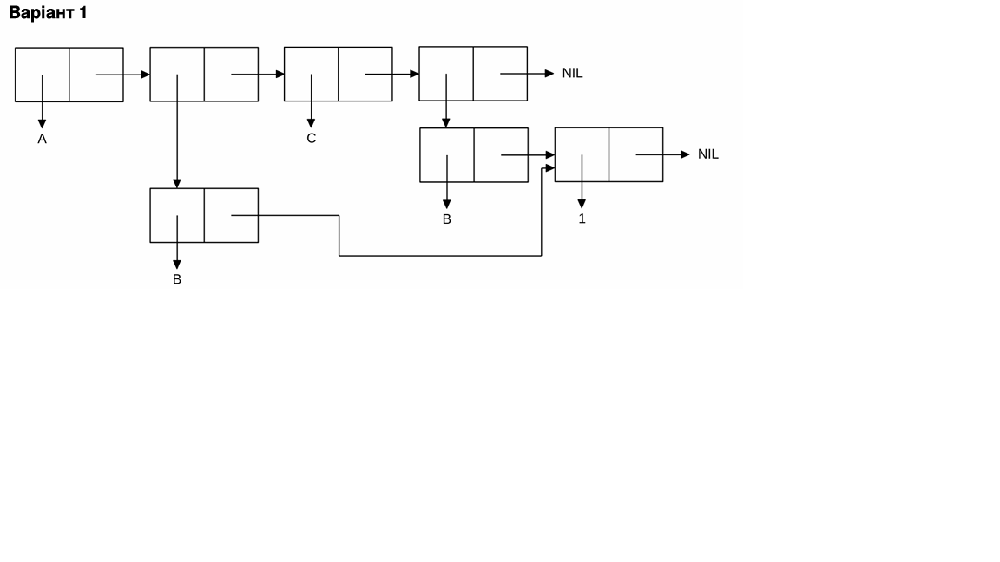

<b>МОНУ НТУУ КПІ ім. Ігоря Сікорського ФПМ СПІСКС</b>

<b>Звіт з лабораторної роботи 1</b> 
"Обробка списків з використанням базових функцій"  
дисципліни "Вступ до функціонального програмування"

<b>Студент</b>: Скібчик Арсен група КВ-21

<b>Рік</b>: 2026

## Загальне завдання
Створіть список з п'яти елементів, використовуючи функції 
створення списку має бути одна — використання LIST і SET чи CONS . Форма SETQ (або інших
допоміжних форм) для збереження проміжних значень не допускається. Загальна
кількість елементів (включно з підсписками та їх елементами) не має
перевищувати 10-12 шт. (дуже великий список робити не потрібно). Збережіть
створений список у якусь змінну з SET або 
SETQ . Список має містити (напряму або у підсписках):
хоча б один символ
хоча б одне число
хоча б один не пустий підсписок
хоча б один пустий підсписок
2. Отримайте голову списку.
3. Отримайте хвіст списку.
4. Отримайте третій елемент списку.
5. Отримайте останній елемент списку.
6. Використайте предикати ATOM та LISTP на різних елементах списку (по 2-3 приклади для кожної функції)ю
7. Використайте на елементах списку 2-3 інших предикати з розглянутих у розділі 4
навчального посібника.
8. Об'єднайте створений список з одним із його непустих підсписків. Для цього
використайте функцію APPEND.
Завдання 1
CL-USER> (defvar lab-list nil)
LAB-LIST
CL-USER> (setq lab-list (list 'alpha 10 (cons 'beta (list 20)) nil 'gamma))
(ALPHA 10 (BETA 20) NIL GAMMA)
CL-USER> 
;; Пункт 2: 
CL-USER> (car lab-list)
ALPHA
;; Пункт 3: 
CL-USER> (cdr lab-list)
(10 (BETA 20) NIL GAMMA)
;; Пункт 4: 
CL-USER> (third lab-list)
(BETA 20)
;; Пункт 5: 
CL-USER> (last lab-list)
(GAMMA)
;; Пункт 6: 
CL-USER> (atom (car lab-list))
T
CL-USER> (atom (third lab-list))
NIL
CL-USER> (listp (third lab-list))
T
CL-USER> (listp (car lab-list))
NIL
;; Пункт 7: Інші предикати
CL-USER> (numberp (second my-list))
T
CL-USER> (null (fourth my-list))
T
CL-USER> (symbolp (car my-list))
T
## Варіант 17

CL-USER> (setq var-list (list 'A (list 'B) 'C (list 'B 1)))
(A (B) C (B 1))
